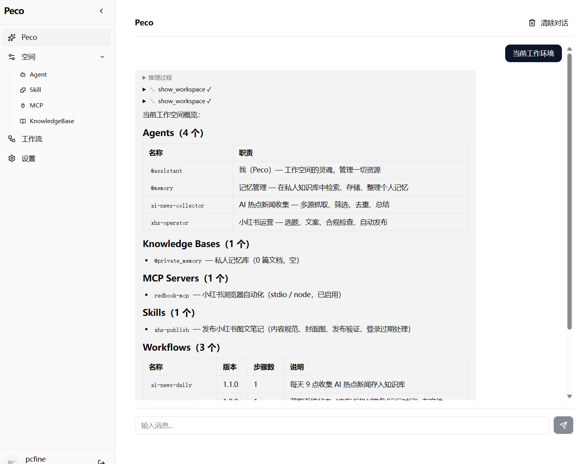
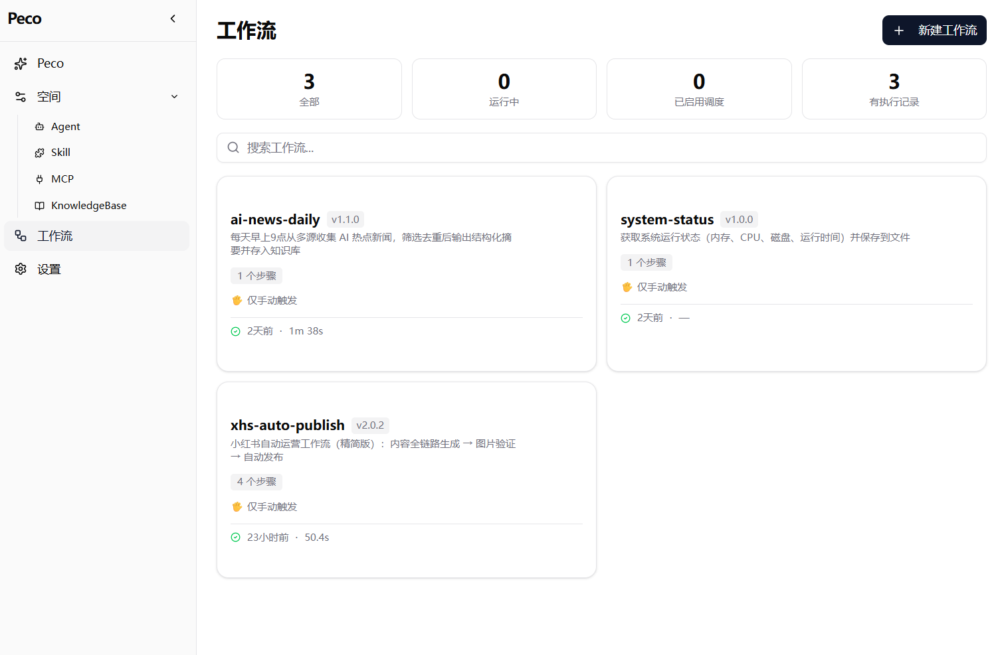

# Peco — AI Agent 平台

基于 **Rust + React** 的全栈 AI Agent 平台。提供 Agent 定义与编排、MCP 协议集成、多模态 RAG 知识库、可视化对话、定时任务调度等完整能力。

## 架构总览

```
┌─────────────────────────────────────────────────────────────┐
│                    Web UI (React 19 + TypeScript)            │
│      SSE 流式对话 · Agent 管理 · 知识库 · 定时任务 · 认证     │
├─────────────────────────────────────────────────────────────┤
│                  peco-server (Axum + Tokio)                  │
│      REST API · SSE 流 · JWT 认证 · 限流 · OpenAPI/Swagger   │
├─────────────────────────────────────────────────────────────┤
│                  peco-core (Agent 引擎)                       │
│  Agent · Session · ReAct Loop · Workflow · WorkSpace · MCP · Skills · Tools · KB │
├────────────────────────┬────────────────────────────────────┤
│     model-provider      │       knowledge-base               │
│   (LLM 统一抽象层)       │   (RAG: 向量+BM25+知识图谱)          │
├────────────────────────┴────────────────────────────────────┤
│    SQLite · LanceDB · FastEmbed · DeepSeek API · MCP Server  │
└─────────────────────────────────────────────────────────────┘
```

## 核心特性

### Agent 引擎
- **声明式定义**：通过 `agent.md`（YAML frontmatter + Markdown）定义 Agent 的模型、工具、MCP、Skills 和 KB 访问白名单
- **ReAct 执行循环**：双层状态机驱动（外层 Idle → ProcessingUserInput → RunningInnerLoop → Paused，内层 PreparingRequest → AwaitingModel/Streaming → ExecutingTools），支持流式 + batch 双路径
- **Workflow 编排**：声明式 DAG 工作流（`workflow.md`），Kahn 拓扑分层并行执行，支持条件门控、minijinja 模板变量传递、失败策略（Continue/Abort/Pause，Retry 已定义待实现）和人工审批暂停/恢复。完整 REST API（11 端点）+ SSE 流式执行追踪 + Cron 定时触发
- **子 Agent 编排**：支持串行委派 (`delegate_sub_agent`) 和并行执行 (`run_parallel_sub_agents`)，前端可视化追踪
- **Session 管理**：状态机驱动（Idle → Active → Commit/Rollback/Cancel），支持 turn 回滚、中断队列。双层持久化：`FileSessionPersister`（CLI，JSON 文件增量追加）和 `SqliteSessionPersister`（Server，SQLite UPSERT）
- **模板初始化**：内置 3 套 Workspace 模板（personal / minimal / developer），`--init-template` / `-t` 一键初始化

### 工具系统
- **26 个内置工具**：
  - **通用**：`shell`、`fetch`、`show_workspace`
  - **Agent CRUD**：`save_agent`、`read_agent`、`delete_agent`、`delegate_sub_agent`、`run_parallel_sub_agents`
  - **Skill CRUD**：`read_skill`、`list_skills`、`save_skill`、`delete_skill`
  - **Workflow CRUD**：`execute_workflow`、`list_workflows`、`save_workflow`、`delete_workflow`
  - **MCP CRUD**：`list_mcp_servers`、`save_mcp_server`、`delete_mcp_server`
  - **知识库**：`search_knowledge`、`list_knowledge_bases`、`add_to_knowledge_base`、`sync_knowledge_base`、`get_knowledge_base_docs`、`add_facts_to_knowledge_base`、`query_entity_facts`
- **MCP 协议**：完整实现 Model Context Protocol，支持 3 种传输（Stdio / SSE / StreamableHTTP），工具自动发现与同步
- **可扩展**：`#[peco_tool]` 宏自动生成工具定义，`Tool`/`ToolDyn` 双 trait 设计

### Personal Memory（PPA）
- **自动记忆提取**：通过 `PpaMemoryHook`（LooperHook）在每轮完成后使用独立 Flash 模型分析对话，自动识别用户偏好、决策、事实
- **三层记忆模型**：Profile（用户身份/偏好）→ Semantic（离散事实/知识）→ Episodic（对话摘要/上下文）
- **知识库存储**：记忆以结构化文档形式存储在 per-user KB 中（`personal_memory_{user_id}`），支持图谱双写和冲突检测（Add/Update/Delete/Noop）
- **智能检索**：`PpaDynamicContext` 在每轮查询前自动注入相关记忆（规则引擎分类 + 向量检索 + 相关性阈值过滤）
- **Agent 协作**：通过 `@assistant → @memory` 子 Agent 模式，使用 KB 工具直接管理记忆

### 知识库（RAG）
- **多格式解析**：PDF、DOCX、HTML、Markdown、代码、纯文本
- **智能分块**：滑动窗口（句子边界对齐）、固定大小、按句子
- **混合检索**：向量搜索 + BM25 全文搜索 + 知识图谱，自适应 RRF 融合（4 层：QueryAnalyzer → PathCalibration → CrossValidation → AdaptiveFusion）
- **本地嵌入**：FastEmbed ONNX 推理，默认 `bge-small-zh-v1.5`（中文优化，512 维）
- **增量同步**：基于确定性 Chunk ID（`{doc_id}-{seq}-{sha256[0..8]}`）的幂等摄入
- **多后端**：InMemory（测试）、LanceDB（Arrow，生产）、HelixDB（feature-gated，HTTP 客户端）

### Skill 系统
- **渐进式加载**：3 级 token 预算控制（Tier 1 名称+描述 → Tier 2 完整正文 → Tier 3 scripts/references/assets），按需激活
- **`SKILL.md` 格式**：与 agent.md 同源，YAML frontmatter + Markdown body
- **目录发现**：`<skill-name>/SKILL.md` 结构，自动扫描注册

### Web 前端
- **SSE 流式对话**：9 种事件类型（`text_delta` / `reasoning_delta` / `tool_call_start` / `tool_result` / `turn_complete` / `agent_call_start` / `agent_call_end` / `error` / `done`）
- **Agent 管理**：创建、编辑、配置工具/MCP/Skills、选择模型参数
- **知识库管理**：上传文档、增量同步、搜索预览
- **定时任务**：Cron 表达式配置，自动执行 Agent 对话，日志查看
- **Workflow 管理**：可视化 DAG 编辑、执行追踪（SSE 实时流）、审批流程
- **认证系统**：JWT HS256（7 天有效期）、登录/注册、路由守卫

### 运维
- **一键部署**：`scripts/deploy.sh` — 编译 → systemd → nginx 全自动
- **API 文档**：Swagger UI (`/docs`) + OpenAPI 规范
- **限流保护**：GCRA 算法（`governor`），per-user 速率限制（默认 20 req/s，burst 100；SSE 端点 1 req/s，burst 3）
- **优雅关闭**：SIGTERM 信号处理，调度器安全停止

## Web UI

基于 **React 19 + TypeScript + Vite** 的现代化前端，提供完整的 Agent 管理与对话体验。

**对话界面**（`pecochat`）—— SSE 实时流式对话，支持推理过程折叠展示、工具调用卡片、子 Agent 委托可视化追踪、Markdown 渲染与代码高亮：



**Workflow 界面**（`workflow`）—— 声明式 DAG 工作流可视化编辑与执行追踪，SSE 实时流式显示步骤执行状态与审批流程：



前端页面包括 `chat`（对话）、`agents`（Agent 管理）、`knowledge`（知识库）、`tasks`（定时任务）、`auth`（登录/注册）、`settings`（设置），通过 Zustand 管理状态，使用 shadcn/ui + Tailwind CSS v4 构建 UI。

## 快速开始

### 前提条件

- **Rust** 1.85+（edition 2024）
- **Node.js** 22+ / npm 10+
- **DeepSeek API Key**（[获取地址](https://platform.deepseek.com/)）

### 1. 克隆并配置

```bash
git clone <repo-url> peco
cd peco

# 配置 API Key
echo "DEEPSEEK_API_KEY=sk-your-key-here" > .env
```

### 2. 开发模式（一键启动）

```bash
bash scripts/dev.sh
```

后端启动于 `http://localhost:9227`，前端启动于 `http://localhost:9233`。API 文档位于 `http://localhost:9227/docs`。

### 3. 生产部署

```bash
# 设置 API Key（若未在 .env 中配置）
export DEEPSEEK_API_KEY=sk-your-key-here

# 一键部署（需要 root 权限）
sudo -E bash scripts/deploy.sh
```

部署后访问 `http://localhost`。

### 4. CLI 模式

```bash
# 从内置模板初始化 Workspace
cargo run -p peco-cli -- -t personal     # 个人助手（默认）
cargo run -p peco-cli -- -t developer    # 开发辅助
cargo run -p peco-cli -- -t minimal      # 最轻量对话

# 启动交互式对话（通过终端菜单选择 Agent 和 Session）
cargo run -p peco-cli

# 自定义 workspace 路径
cargo run -p peco-cli -w /path/to/workspace

# 禁用彩色输出 / 推理过程 / 工具调用显示
cargo run -p peco-cli -- --no-color --show-reasoning=false --show-tools=false

# 运行 Workflow 演示
cargo run -p peco-core --example workflow_demo
```

## 项目结构

```
peco/
├── crates/
│   ├── peco-core/              # Agent 引擎：ReAct Loop、Session、Workflow、WorkSpace、MCP、Skills、Tools
│   ├── peco-server/            # Web 服务：Axum REST API、SSE、JWT、Cron 调度、PPA 记忆管理
│   ├── peco-cli/               # 命令行 AI 助手（交互式菜单）
│   ├── model-provider/         # LLM 统一抽象层（DeepSeek 实现；OpenAI/Anthropic/Ollama/Groq 类型已定义）
│   ├── knowledge-base/         # RAG 引擎：解析→分块→嵌入→混合检索（InMemory/LanceDB/HelixDB 三后端）
│   ├── peco-agents/            # 内置 Workspace 模板（编译时嵌入）
│   └── peco-derive/            # 过程宏（#[peco_tool]）
├── webui/                      # React 19 前端
│   ├── src/
│   │   ├── api/                # API 层（axios + SSE 流解析器）
│   │   ├── pages/              # 页面（chat/agents/knowledge/tasks/auth/settings）
│   │   ├── components/         # UI 组件（shadcn/ui）
│   │   ├── stores/             # Zustand 状态管理
│   │   └── types/              # TypeScript 类型定义
│   └── package.json
├── scripts/
│   ├── dev.sh                  # 开发环境一键启动
│   ├── deploy.sh               # 生产部署脚本
│   └── env.example             # 环境变量示例
├── docs/
│   ├── workflow-design.md       # Workflow 模块技术方案（v1.4）
│   ├── workflow-sse.md          # Workflow SSE 流式端点设计
│   └── design/                  # 详细设计文档（Agent 架构、Workflow UI、重构报告等）
├── Cargo.toml                  # Rust workspace
└── .env                        # 环境变量（API Key 等）
```

## Agent 定义示例

创建 `agent.md` 文件定义 Agent：

```yaml
---
agent:
  name: "代码审查员"
  description: "负责代码质量审查和技术方案评审"
llm:
  provider: "deepseek"
  model: "deepseek-v4-pro"
  temperature: 0.3
tools:
  - shell
  - fetch
  - search_knowledge
mcp:
  - helixdb-docs
skills:
  - code-review
knowledge_bases:
  - @project_docs
max_turns: 30
---

# System Prompt

你是一位资深代码审查专家，拥有 10 年以上的软件工程经验。

## 你的职责
1. 审查代码的正确性和安全性
2. 识别性能瓶颈和架构问题
3. 提供可操作的具体改进建议

## 工作流程
- 首先理解代码的业务意图
- 检查边界条件和错误处理
- 评估代码可维护性和可测试性
```

### Workflow 定义示例

创建 `workflow.md` 文件定义声明式 DAG 工作流：

```yaml
---
workflow:
  name: "ci-pipeline"
  description: "CI 流水线：Lint → Test → Build"
  version: "1.0"
  timeout_seconds: 300
steps:
  - id: "lint"
    name: "Lint"
    type: shell
    config:
      command: "cargo clippy -- -D warnings 2>&1"
    on_failure: "continue"

  - id: "test"
    name: "Test"
    type: shell
    config:
      command: "cargo test --workspace 2>&1"
    depends_on: ["lint"]
    condition: "{{ steps.lint.success }}"
    on_failure: "abort"

  - id: "build"
    name: "Build"
    type: shell
    config:
      command: "cargo build --release 2>&1"
    depends_on: ["test"]
    on_failure: "pause"
---
```

Workflow 支持 Shell、Agent 两种步骤类型（Llm、Tool 为 Phase 4 规划），通过 `depends_on` 定义 DAG 拓扑，`condition` 控制条件执行，`{{ steps.X.output }}` 在步骤间传递数据。

## 配置

### 环境变量

| 变量 | 必需 | 说明 |
|------|------|------|
| `DEEPSEEK_API_KEY` | ✓ | DeepSeek API 密钥 |
| `PECO_SERVER_HOST` | - | 服务监听地址（默认 `0.0.0.0`） |
| `PECO_SERVER_PORT` | - | 服务端口（默认 `9227`） |
| `PECO_JWT_SECRET` | - | JWT 签名密钥（三层降级：环境变量 → DB → 随机生成+持久化） |
| `PECO_DATA_DIR` | - | 数据目录（默认 `~/.peco/`） |
| `PECO_DATABASE_URL` | - | SQLite 数据库路径（默认 `sqlite:~/.peco/server.db?mode=rwc`） |
| `PECO_WORKSPACE` | - | CLI workspace 根目录（默认 `./`） |
| `PECO_INIT_TEMPLATE` | - | CLI 模板初始化（personal / minimal / developer） |
| `NO_COLOR` | - | CLI 禁用彩色输出 |

### providers.toml（LLM Provider 配置）

```toml
default_provider = "deepseek"

[providers.deepseek]
type = "deepseek"
api_key = "${DEEPSEEK_API_KEY}"
base_url = "https://api.deepseek.com"

[providers.deepseek.default]
model = "deepseek-v4-flash"
temperature = 0.7
max_tokens = 4096
stream = true
```

Provider 类型定义支持 `deepseek`、`openai`、`anthropic`、`ollama`、`groq`（当前仅 DeepSeek 有完整实现）。配置文件位于 workspace 根目录，支持 `${ENV_VAR}` 语法引用环境变量。

### API 文档

启动后端后访问 `http://localhost:9227/docs` 查看 Swagger UI。

## 技术栈

| 层 | 技术 |
|----|------|
| Agent 引擎 | Rust (Tokio async) |
| Web 后端 | Axum + SQLite (sqlx) + JWT (jsonwebtoken) |
| LLM 抽象 | async-trait 动态分发 |
| RAG 引擎 | LanceDB + FastEmbed (ONNX) + BM25 |
| MCP 协议 | rmcp (Stdio + SSE + StreamableHTTP) |
| Web 前端 | React 19 + TypeScript 6 + Vite 8 |
| UI 框架 | Tailwind CSS v4 + shadcn/ui (Radix) |
| 状态管理 | Zustand 5 |
| 部署 | systemd + nginx |

## 开发

```bash
# 运行所有测试
cargo test --workspace

# 运行特定 crate 测试
cargo test -p peco-core
cargo test -p peco-core -- --nocapture          # 显示测试输出
cargo test -p peco-server
cargo test -p knowledge-base

# 前端测试
cd webui && npx vitest run

# TypeScript 类型检查
cd webui && npx tsc --noEmit

# 代码格式化
cargo fmt --all
cd webui && npx prettier --write src/

# Lint（CI 中 warning 视为 error）
cargo clippy --workspace -- -D warnings
```

## 实现路线

- [x] 声明式 Workflow 编排引擎（DAG 拓扑 + 模板变量 + 条件门控 + 失败策略 Continue/Abort/Pause）— Phase 1–2 ✅
- [x] Workflow peco-server 集成（REST API + SSE 流式 + SQLite 持久化 + Cron 触发）— Phase 3 ✅
- [ ] Workflow 高级特性（Llm/Tool 步骤类型、Retry 重试逻辑、StepDelta 增量事件、HumanApproval 步骤、子 Workflow 嵌套）— Phase 4
- [ ] OpenAI / Anthropic / Ollama / Groq Provider 完整实现
- [ ] 结构化输出（Structured Output Executor）
- [ ] 对话分支（Branching）与 A/B 对比
- [ ] MCP WebSocket 传输

## License

MIT OR Apache-2.0

---

**[English Version](#english-version)** | **[中文版](#peco--ai-agent-平台)**

---

<h2 id="english-version">Peco — AI Agent Platform</h2>
<h3><a href="#peco--ai-agent-平台">← 中文版</a></h3>

A full-stack AI Agent platform built on **Rust + React**. Provides Agent definition & orchestration, MCP protocol integration, multimodal RAG knowledge base, visual chat interface, and cron-based task scheduling.

### Architecture

```
┌─────────────────────────────────────────────────────────────┐
│                    Web UI (React 19 + TypeScript)            │
│     SSE Streaming · Agent Mgmt · Knowledge · Tasks · Auth    │
├─────────────────────────────────────────────────────────────┤
│                  peco-server (Axum + Tokio)                  │
│      REST API · SSE · JWT Auth · Rate Limit · OpenAPI        │
├─────────────────────────────────────────────────────────────┤
│                  peco-core (Agent Engine)                     │
│ Agent · Session · ReAct Loop · Workflow · WorkSpace · MCP · Skills · Tools · KB │
├────────────────────────┬────────────────────────────────────┤
│     model-provider      │       knowledge-base               │
│     (LLM Abstraction)   │   (RAG: Vector+BM25+Graph)         │
├────────────────────────┴────────────────────────────────────┤
│    SQLite · LanceDB · FastEmbed · DeepSeek API · MCP Server  │
└─────────────────────────────────────────────────────────────┘
```

### Key Features

- **Agent Engine**: Declarative `agent.md` definitions, dual-state-machine ReAct loop (outer Idle→Processing→Running→Paused, inner Prepare→Model/Stream→Tools), DAG workflow orchestration (`workflow.md` with topology-level parallelism, condition gating, minijinja templates, Continue/Abort/Pause failure policies), sub-agent orchestration (serial delegation / parallel execution), state-machine-based Session management with rollback & interrupt queue, dual persistence (FileSessionPersister for CLI, SqliteSessionPersister for server), built-in workspace templates (`--init-template`)
- **Tool System**: 26 built-in tools (shell, fetch, full CRUD for Agents/Skills/Workflows/MCP servers, 7 KB tools), full MCP protocol support (Stdio + SSE + StreamableHTTP), auto tool discovery & sync, extensible `Tool`/`ToolDyn` trait design with `#[peco_tool]` macro
- **Personal Memory (PPA)**: Auto memory extraction via `PpaMemoryHook` with independent Flash model, three-tier memory (Profile → Semantic → Episodic) stored as KB documents with graph dual-write, smart retrieval via `PpaDynamicContext` (rule-based query classification + vector search + relevance threshold), agent-driven memory management through `@assistant → @memory` sub-agent pattern using KB tools
- **RAG Knowledge Base**: Multi-format parsing (PDF/DOCX/HTML/MD/Code/TXT), intelligent chunking with deterministic IDs for idempotent ingestion, hybrid search (vector + BM25 + knowledge graph) with 4-layer adaptive RRF fusion, local ONNX embeddings (Chinese-optimized `bge-small-zh-v1.5`, 512-dim), three backends (InMemory/LanceDB/HelixDB)
- **Skill System**: 3-tier progressive loading (name+desc → full body → scripts/references/assets), `SKILL.md` format, automatic directory discovery
- **Web UI**: SSE streaming chat with 9 event types, Agent CRUD, knowledge base management, workflow DAG editor with real-time execution tracking, cron task scheduling, JWT HS256 authentication (7-day expiry)
- **Operations**: One-command deploy via `deploy.sh`, Swagger API docs, GCRA rate limiting (20 req/s default, 1 req/s for SSE), graceful shutdown

### Web UI

A modern frontend built on **React 19 + TypeScript + Vite**, offering a complete Agent management and chat experience.

**Chat interface** — real-time SSE streaming with collapsible reasoning, tool-call cards, sub-agent delegation tracking, Markdown rendering and code highlighting:


**Workflow interface** — visual declarative DAG editor with SSE live execution tracking and approval flows:


Pages include `chat`, `agents`, `knowledge`, `tasks`, `auth`, and `settings` — state managed with Zustand, UI built with shadcn/ui + Tailwind CSS v4.

### Quick Start

**Prerequisites**: Rust 1.85+, Node.js 22+, DeepSeek API Key

```bash
# Clone and configure
git clone <repo-url> peco && cd peco
echo "DEEPSEEK_API_KEY=sk-your-key-here" > .env

# Development (both backend + frontend)
bash scripts/dev.sh
# Backend: http://localhost:9227  |  Frontend: http://localhost:9233
# API Docs: http://localhost:9227/docs

# Production deployment
sudo -E bash scripts/deploy.sh
# Visit http://localhost

# CLI mode
cargo run -p peco-cli -- -t personal          # init workspace from template
cargo run -p peco-cli                          # interactive chat (menu-based Agent/Session selection)
cargo run -p peco-cli -w /path/to/workspace    # custom workspace path
cargo run -p peco-core --example workflow_demo # workflow demo
```

### Tech Stack

| Layer | Technology |
|-------|-----------|
| Agent Engine | Rust (Tokio async) |
| Web Backend | Axum + SQLite (sqlx) + JWT (jsonwebtoken) |
| LLM Abstraction | async-trait dynamic dispatch |
| RAG Engine | LanceDB + FastEmbed (ONNX) + BM25 |
| MCP Protocol | rmcp (Stdio + SSE + StreamableHTTP) |
| Frontend | React 19 + TypeScript 6 + Vite 8 |
| UI | Tailwind CSS v4 + shadcn/ui (Radix) |
| State | Zustand 5 |
| Deploy | systemd + nginx |

### Development

```bash
cargo test --workspace              # All tests
cargo test -p peco-core -- --nocapture  # With output
cd webui && npx vitest run           # Frontend tests
cd webui && npx tsc --noEmit         # TypeScript check
cargo fmt --all                      # Format Rust
cargo clippy --workspace -- -D warnings  # Lint
```

### Roadmap

- [x] Declarative Workflow engine (DAG + templates + conditions + Continue/Abort/Pause) — Phase 1–2 ✅
- [x] Workflow server integration (REST API + SSE streaming + SQLite persistence + Cron trigger) — Phase 3 ✅
- [ ] Workflow advanced features (Llm/Tool step types, Retry logic, StepDelta streaming, HumanApproval, nested workflows) — Phase 4
- [ ] OpenAI / Anthropic / Ollama / Groq full provider implementations
- [ ] Structured Output Executor
- [ ] Conversation branching & A/B comparison
- [ ] MCP WebSocket transport

### License

MIT OR Apache-2.0
